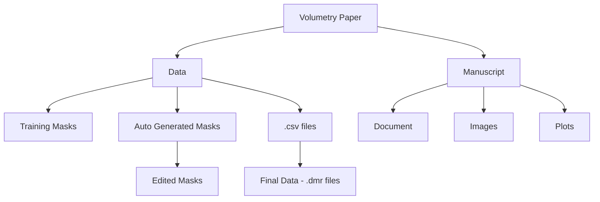

# Renal Volumetry Paper

## 📁 Repository Overview

This repository contains all materials related to the paper:

- 📜 [Manuscript](https://docs.google.com/document/d/1L143lAdu8BfLrkVTEY1y5ZnZTe6ZOs-xBgYS53W6nsw/edit?usp=sharing)
- 📊 [Final Data](https://drive.google.com/drive/u/1/folders/1-g3WZZKO1y1eQyAiZwgaofX2Zd4s35cT)
- 📈 [Figures](https://drive.google.com/drive/u/1/folders/1hV_f3ofe-5JJVM9FZHp_YBZyT-5HmRJ8) and [plots](https://drive.google.com/drive/u/1/folders/1iAzip3OsMUd6ud0WxBglLW4eD9gVv0Ea)
- 🧮 Code used for analysis
- 🧠 [Current Hypothesis](https://github.com/JoaoPeriquito/Volumetric-Paper/wiki/Hypotheses-Log)
- 📚 Supplementary materials:
    - [Joao's presentation](https://docs.google.com/presentation/d/19h2q0bE5W7bgc5uiPAqjPcGWYzESoKZ_/edit?usp=sharing&ouid=106782107287624600181&rtpof=true&sd=true) iBEAt meeting (15/05/2025)

## Kidney Segmentation Progress

| Site             | Scans on XNAT (BL&FU) | Kidneys Autosegmented (Sheffield) | Kidney masks Checked & Edited (Lund) | Biomarkers Exported (Sheffield) |
|------------------|------------------------|------------------------------------|---------------------------------------|----------------------------------|
| Leeds            | 62                     | 53                                 | 50                                    | 43                               |
| Exeter           | 150                    | 130                                | 118                                   | 109                              |
| Turku            | 124                    | 84                                 | 18                                    | 6                                |
| Bordeaux         | 75                     | 66                                 | 65                                    | 63                               |
| Bari             | 76                     | 50                                 | 0                                     | 0                                |
| Sheffield        | 136                    | 72                                 | 0                                     | 0                                |
| **Total XNAT**   | **623**                | **455**                             | **251**                               | **221**                          |
| **Total MRIs Expected** | **628**         |                                    |                                       |                                  |
| **Percentage MRIs Done** |              | **72**                              | **40**                                | **35**                           |

[Overview File](https://docs.google.com/spreadsheets/d/1jGKE69HscmHufjyAdU29GqbEUsG6fa4S/edit?usp=sharing&ouid=106782107287624600181&rtpof=true&sd=true)

## Methodology

### 1. Image Acquisition and Preprocessing
- **Modality**: Post contrast MRI Dixon sequences, including:
  - In-phase images, [example](https://drive.google.com/file/d/1Ki8mcTZX7XZceNvyRSJyCAdQNifsENcL/view?usp=drive_link)  
  - Out-of-phase images, [example](https://drive.google.com/file/d/1uu7wcxBe-Z-W0kLeN_j-DGC3Rn8zt5GN/view?usp=sharing)
  - Fat map images, [example](https://drive.google.com/file/d/12QH3-LoywpcyAZZlaZpNlcQcUD-Sy_QU/view?usp=drive_link)
  - Water map images [example](https://drive.google.com/file/d/15lraJEvopL4QZaALIze2zWTmDoLw0A-P/view?usp=drive_link)

### 2. AI Kidney Segmentation
- **Segmentation Tool**: [nnU-Net](https://github.com/MIC-DKFZ/nnUNet), [trained model](https://zenodo.org/records/15328218)
- **Segmentation Targets**:  
  - **Left Kidney (LK)**  
  - **Right Kidney (RK)**
  - **Both Kidneys (BK)**
- **Input Channels**: All four post-contrast Dixon MRI sequences were provided as multi-channel input to nnU-Net.
- **Output**: [masks example - red and green,](https://drive.google.com/file/d/1UiemPWvhu9u4BljqK3-fMBWz2F-49hy1/view?usp=drive_link) for the left and right kidneys respectively.

### 3. Segmentation Refinement
- Post-processing of nnU-Net outputs, was performed using manual and/or semi-automated tools from [Wezel](https://github.com/plaresmedima/wezel).

### 4. Feature Extraction
#### 4.1 Scikit-image (in-house metrics computed using Scikit-image) 
- **Library Used**: [Scikit-image](https://scikit-image.org/), an open-source Python library that provides a collection of image processing algorithms for scientific and biomedical applications.
- **Shape Features**
[Summary table](https://gitlab.com/JoaoPeriquito/volumetry_paper/-/wikis/In-house-features-using-Scikit-image)
#### 4.2 PyRadiomics
- **Library Used**: [PyRadiomics](https://pyradiomics.readthedocs.io/), a Python package for extracting engineered features from medical images.
- **Features Extracted**:
  - **[Shape Features](https://pyradiomics.readthedocs.io/en/latest/features.html#module-radiomics.shape)**: volume, surface area, sphericity, elongation, etc. [Summary table](https://gitlab.com/JoaoPeriquito/volumetry_paper/-/wikis/PyRadiomics-shape-features)
  - **Texture Features**: derived from:
    - [GLCM](https://pyradiomics.readthedocs.io/en/latest/features.html#module-radiomics.glcm) (Gray Level Co-occurrence Matrix)
    - [GLRLM](https://pyradiomics.readthedocs.io/en/latest/features.html#module-radiomics.glrlm) (Gray Level Run Length Matrix)
    - [GLSZM](https://pyradiomics.readthedocs.io/en/latest/features.html#module-radiomics.glszm) (Gray Level Size Zone Matrix)
    - [NGTDM](https://pyradiomics.readthedocs.io/en/latest/features.html#module-radiomics.ngtdm) (Neighborhood Gray Tone Difference Matrix)
    - [GLDM](https://pyradiomics.readthedocs.io/en/latest/features.html#module-radiomics.gldm) (Gray Level Dependence Matrix)
    - [Summary table](https://gitlab.com/JoaoPeriquito/volumetry_paper/-/wikis/Texture-features-PyRadiomics)
- **Inputs**:
    - Shape features:
        - The MRI Dixon water map images
        - The segmented kidney masks (LK and RK)
        - Affine matrix
    - Texture features:
        - The original MRI Dixon images (in-phase, out-phase, water and fat)
        - The segmented kidney masks (LK and RK)
        - Affine matrix

### 5. Data Handling and Analysis
- All extracted features were organized per subject and kidney side (LK, RK, BK).
- All extracted features were organized per subject and kidney side (LK, RK, BK).
- Features were used for downstream statistical analysis or machine learning applications, depending on the study objective (e.g., disease classification, progression prediction).

## File Organization

### 📂 Linked Resources

**Data:**
- [**Training Masks**](https://drive.google.com/drive/u/1/folders/1Y1KQUfxa8W16sZZBWq718WcsZ80Q9cyV), needed [script](https://github.com/QIB-Sheffield/iBEAt/blob/Development/scripts/Folder_Volumetry_1_dcmTrainingMasks_Dixons.py)
- [**Auto Generated Masks**](https://drive.google.com/drive/u/1/folders/1iVU4aOqZPjYY1chcHKwDkVCT5_QTNojL) needed [script](https://github.com/QIB-Sheffield/iBEAt/blob/Development/scripts/Folder_Volumetry_2_dcmFinalMasks_Dixons.py)
  - [**Edited Masks**](https://drive.google.com/drive/u/1/folders/1QxUPnd61INezsGj0Xlnb8c24bjxDcR1A), masks were edited using [Wezel python package](https://pypi.org/project/wezel/)
- [**.csv files**](https://drive.google.com/drive/u/1/folders/1xhT6DlThcXqxY4_d0dbZ1EV7kDk8Xfh-), needed [script](https://github.com/QIB-Sheffield/iBEAt/blob/Development/scripts/Folder_Volumetry_3_csvBiomarkers_main%20copy.py)
    - [**Final Data - .dmr files**](https://drive.google.com/drive/u/1/folders/1-g3WZZKO1y1eQyAiZwgaofX2Zd4s35cT), needed [script](https://github.com/QIB-Sheffield/iBEAt/blob/Development/utilities/convert_csv_dmr.py)

**Manuscript:**
- [**.doc file**](https://docs.google.com/document/d/1L143lAdu8BfLrkVTEY1y5ZnZTe6ZOs-xBgYS53W6nsw/edit?usp=sharing)
- [**Figures**](https://drive.google.com/drive/u/1/folders/1hV_f3ofe-5JJVM9FZHp_YBZyT-5HmRJ8)
- [**Plots**](https://drive.google.com/drive/u/1/folders/1iAzip3OsMUd6ud0WxBglLW4eD9gVv0Ea)

## Collaborate with your team

- [ ] [Invite team members and collaborators](https://docs.gitlab.com/ee/user/project/members/)
- [ ] [Create a new merge request](https://docs.gitlab.com/ee/user/project/merge_requests/creating_merge_requests.html)
- [ ] [Automatically close issues from merge requests](https://docs.gitlab.com/ee/user/project/issues/managing_issues.html#closing-issues-automatically)
- [ ] [Enable merge request approvals](https://docs.gitlab.com/ee/user/project/merge_requests/approvals/)
- [ ] [Set auto-merge](https://docs.gitlab.com/user/project/merge_requests/auto_merge/)
